# Houseslice (HOUSLICE)

A verified, student-only housing marketplace for Kigali — find compatible
housemates, book rooms and short-term sublets, all inside a trusted student
community. Built by **Group 22** (African Leadership University) as the
Flutter + Firebase implementation of our Figma prototype.

- **Firebase project:** `houseslice-69a7f`
- **Android package:** `com.group22.houslice`
- **Report:** [`docs/REPORT.md`](docs/REPORT.md) → PDF at
  [`docs/Group22_Final_Project_Submission.pdf`](docs/Group22_Final_Project_Submission.pdf)
  (regenerate with `python tool/build_report.py`)
- **Database design:** [`docs/ERD.md`](docs/ERD.md) · **Demo video script:**
  [`docs/VIDEO_SCRIPT.md`](docs/VIDEO_SCRIPT.md)

## Features

- **Onboarding** — branded splash, three intro slides, location chooser.
  Whether the intro appears is a saved preference, so returning users skip it.
- **Two authentication methods** — university-email/password *and* Google
  Sign-In. Both are gated to allowed university domains, so a personal Gmail
  cannot get in. Includes a password-reset flow and email verification.
- **Lifestyle questionnaire** — eleven questions plus a free-text intro,
  covering sleep, cleanliness, social life, guests, study habits, smoking,
  budget, sharing, pets, and gender preference.
- **Compatibility matching** — every shared-home listing shows a live match
  percentage, and a **"Why?"** sheet breaks it down across nine dimensions with
  a sentence explaining each one.
- **Student vs realtor badges** — every listing shows at a glance whether it
  came from a fellow student or a letting agent.
- **Publish a listing** — students sublet a room, agents post a whole property.
- **My Listings** — edit or delete anything you published, scoped to your own
  `ownerUid` so the UI offers exactly what the security rules permit.
- **Explore + Search** — grid browsing, live search with Recent / Result
  sections and a "Search not found" empty state.
- **Listing details** — photo gallery with thumbnails, about section, verified
  host card, share sheet.
- **Favorites** — per-user, synced to Firestore, optimistic heart toggle.
- **Booking flow** — range calendar, payment method selection (card / MoMo),
  Add Card with Luhn validation, price breakdown with tax, success sheet.
- **My Booking** — Upcoming / Completed / Cancelled tabs with status chips,
  write-review sheet and call-agent action, playful "Opps!!" empty states.
- **Settings** — four preferences persisted across restarts: colour theme
  (system/light/dark), notification opt-in, preferred district, onboarding replay.
- **Profile** — edit profile, change password, notifications, about, sign out.

## Screenshots

Captured from a **release build on a Samsung Galaxy S22 Ultra** (Android 15),
running against the live Firebase backend.

| Register | Lifestyle questionnaire | Home |
|---|---|---|
| 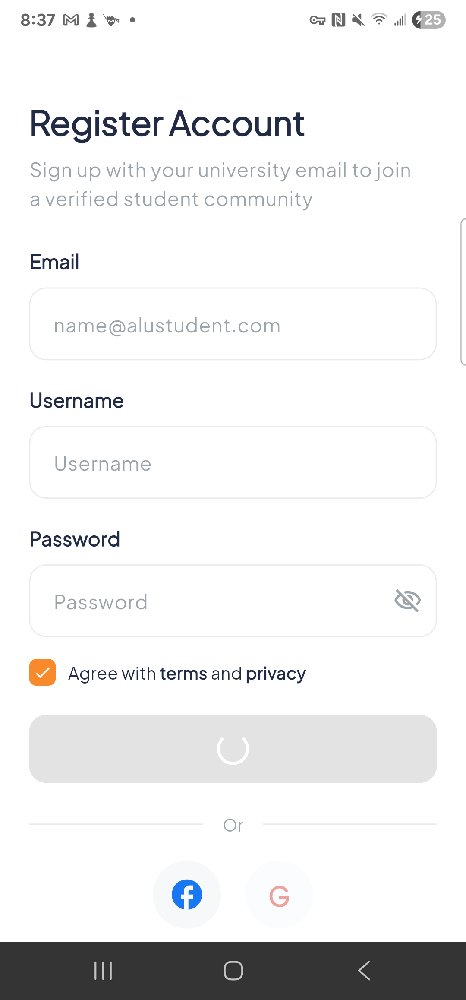 | 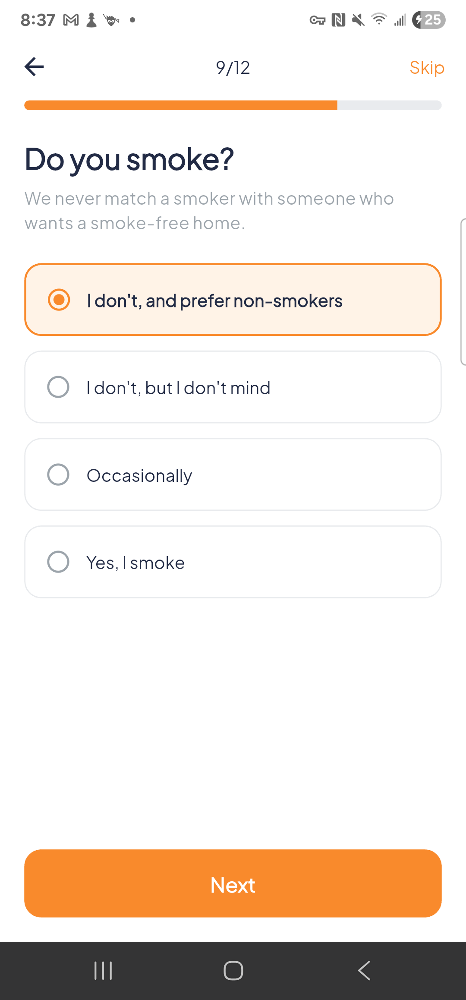 | 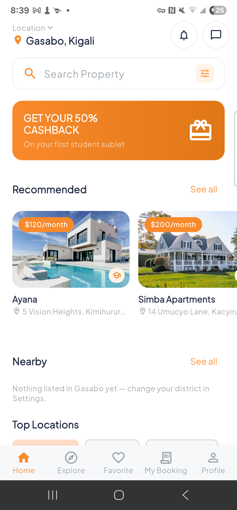 |

| Listing details | Why compatible? | Explore |
|---|---|---|
| 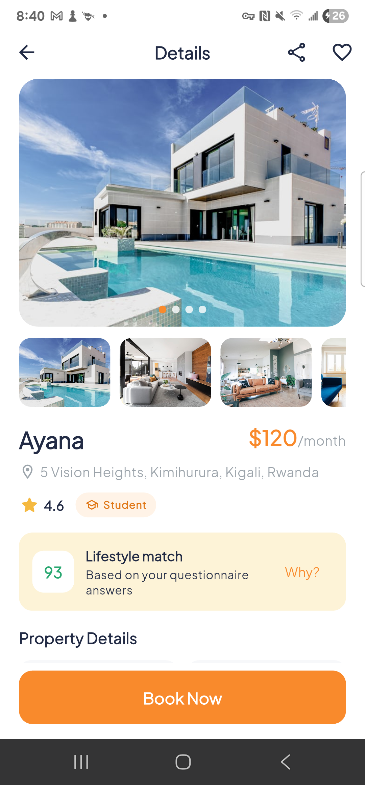 | 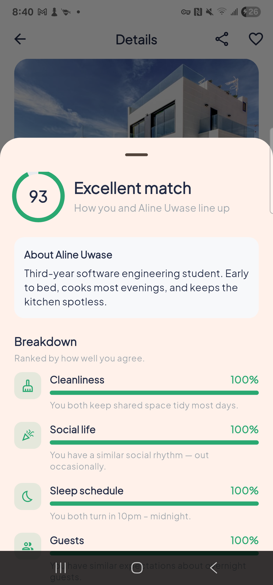 | 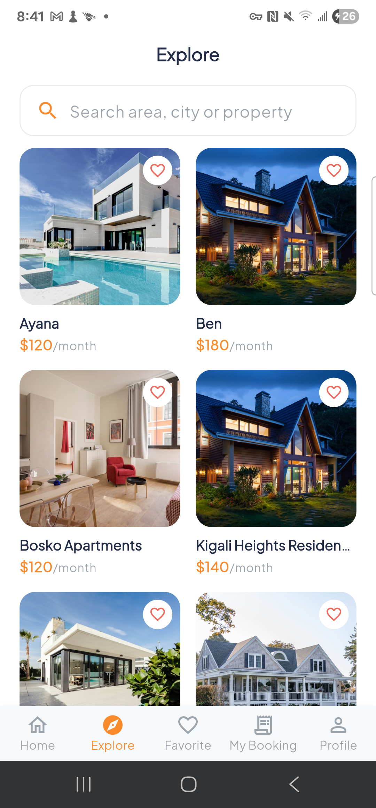 |

| Favorites | My Booking | Profile |
|---|---|---|
| 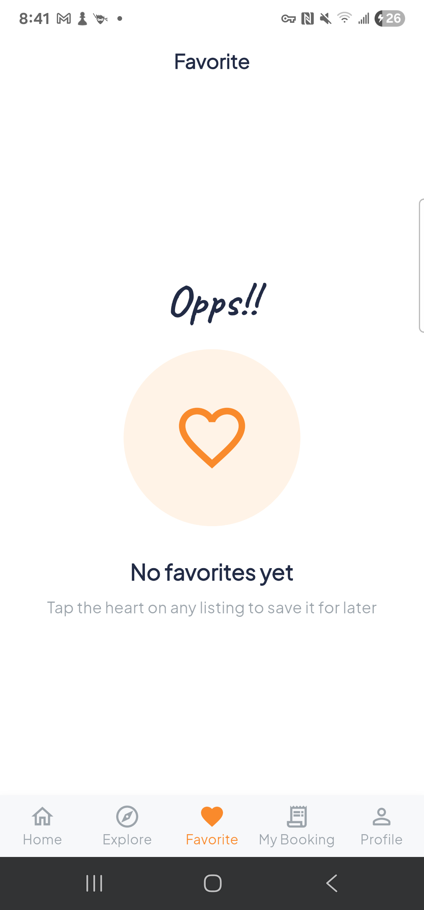 | 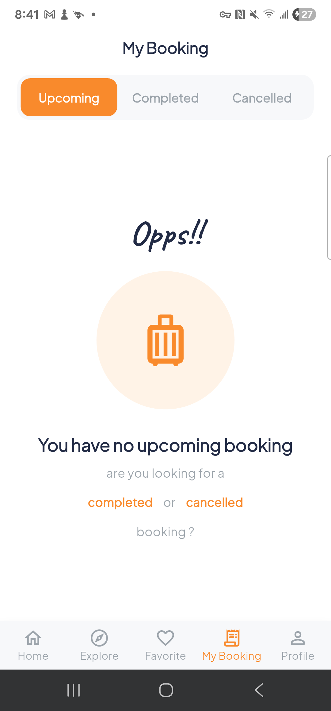 | 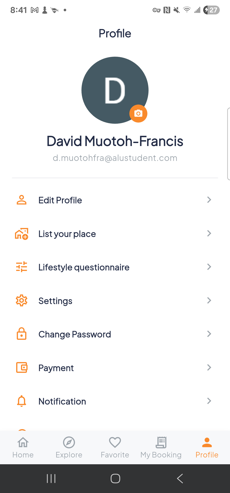 |

| Settings (light) | Settings (dark) |
|---|---|
| 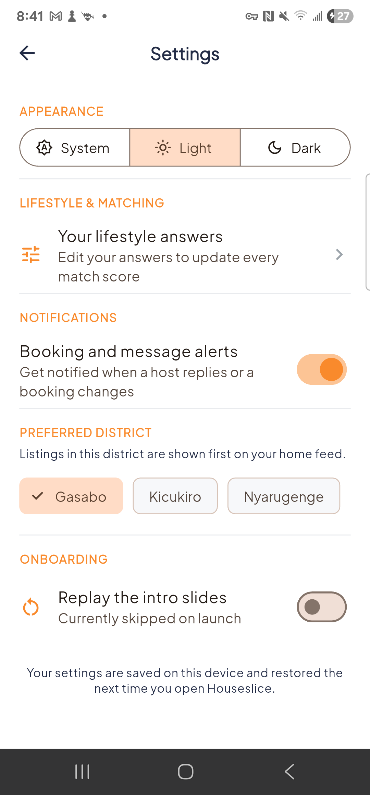 | 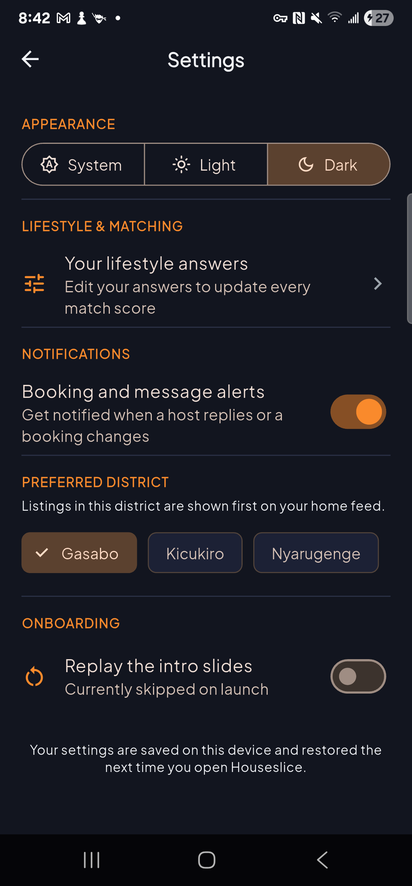 |

## Architecture

Clean Architecture with **BLoC** (`flutter_bloc`) — no `setState` anywhere;
`StatefulWidget` appears only to own controller lifecycles (text fields,
page views).

```
lib/
├── main.dart                 # Firebase bootstrap, preference preload
├── app.dart                  # MaterialApp + global bloc providers
├── injection_container.dart  # get_it dependency injection
├── firebase_options.dart     # generated by `flutterfire configure`
├── core/                     # theme, errors, Result type, use case base,
│                             # validators, formatters, shared widgets, router
└── features/
    ├── auth/            # email/password + Google, reset, verification
    ├── lifestyle/       # questionnaire, compatibility scoring
    ├── onboarding/      # splash, slides, location picker
    ├── property/        # listings, search, favourites, create listing
    ├── booking/         # checkout, calendar, payment, my bookings
    ├── settings/        # persisted preferences
    ├── notifications/
    ├── profile/
    └── shell/           # bottom-nav main shell
```

Each feature follows the same dependency rule:
**presentation → domain ← data**. Use cases return a `Result<T>`
(`Success` / `Err(Failure)`), so blocs never see exceptions or
data-layer types.

### State management

| Concern | Solution |
|---|---|
| Auth session, sign in/up/out, Google, profile, verification | `AuthBloc` |
| Password reset flow | `PasswordResetCubit` |
| Listings + favorites | `PropertyBloc` (optimistic favorite toggle) |
| Publishing a listing | `CreateListingCubit` |
| Search results + recents | `SearchCubit` |
| Bookings (load/create/cancel) | `BookingBloc` |
| Checkout form (dates, payment method) | `BookingFormCubit` |
| Lifestyle answers (app-wide) | `LifestyleCubit` |
| Questionnaire progress | `QuizCubit` |
| User preferences | `PreferencesCubit` |
| Small UI state (tabs, toggles, gallery index) | `ToggleCubit` / `IndexCubit` |

## Getting started

```sh
flutter pub get
flutter run                    # debug
flutter build apk --release    # release APK
```

`lib/firebase_options.dart` is already generated for `houseslice-69a7f`, so the
app connects to the live backend on first run. Firebase client keys are public
identifiers — the data is protected by the security rules, not by hiding the
key.

The catalogue starts empty against a fresh Firebase project, because the rules
only accept listings owned by the caller. Create one through
**Profile → List your place**.

### Demo mode

If `firebase_options.dart` is still a placeholder, `main.dart` catches the
failure and the container registers in-memory data sources instead, so the app
stays fully navigable with no backend. Demo account:
`j.simmons@alustudent.com` / `password123`.

### Pointing at your own Firebase project

1. Create a project at <https://console.firebase.google.com>.
2. Enable **Authentication → Email/Password** and **Google**, and create a
   **Cloud Firestore** database.
3. ```sh
   dart pub global activate flutterfire_cli
   flutterfire configure --project=<your-project-id> --platforms=android,ios
   firebase deploy --only firestore:rules,firestore:indexes
   ```
4. Register your debug SHA-1 against the Android app, or Google Sign-In fails
   with `ApiException: 10`:
   ```sh
   keytool -list -v -keystore ~/.android/debug.keystore \
     -alias androiddebugkey -storepass android
   ```

## Database and security

Full ERD, field tables, and rule rationale: [`docs/ERD.md`](docs/ERD.md).

| Path | Read | Write |
|---|---|---|
| `properties/{id}` | any signed-in user | create only as yourself; edit/delete only your own |
| `users/{uid}` | owner only | owner only; `email` immutable |
| `users/{uid}/favorites/{id}` | owner only | owner only |
| `users/{uid}/bookings/{id}` | owner only | owner only; only `status` may change |
| anything else | denied | denied |

Rules live in [`firestore.rules`](firestore.rules) and indexes in
[`firestore.indexes.json`](firestore.indexes.json). Both are deployed.

## Quality checks

```sh
flutter analyze lib test   # 0 issues
flutter test               # 303 tests, all passing
flutter test --coverage    # 74.6% line coverage
dart format lib test
```

Widget tests run against the real dependency graph in demo mode, so one screen
test exercises presentation, domain, and data together. Every argument-free
screen is asserted at 320×568, 430×932, and 932×430 landscape by
[`test/features/responsive_layout_test.dart`](test/features/responsive_layout_test.dart)
— which is how ten real layout overflow bugs were found and fixed.

## Notes

- Android `minSdk` is 23 (required by `firebase_auth`).
- Listing photos can be picked from the device gallery. Because Cloud Storage
  needs the Blaze plan, they are compressed and embedded on the Firestore
  document as data URIs (capped at 180 KB each); seeded listings use remote URLs
  with offline placeholders, so the UI degrades gracefully with no network.
- Payment capture, in-app messaging, and map tiles are not implemented in this
  milestone — see "Known Limitations and Future Work" in
  [`docs/REPORT.md`](docs/REPORT.md).
