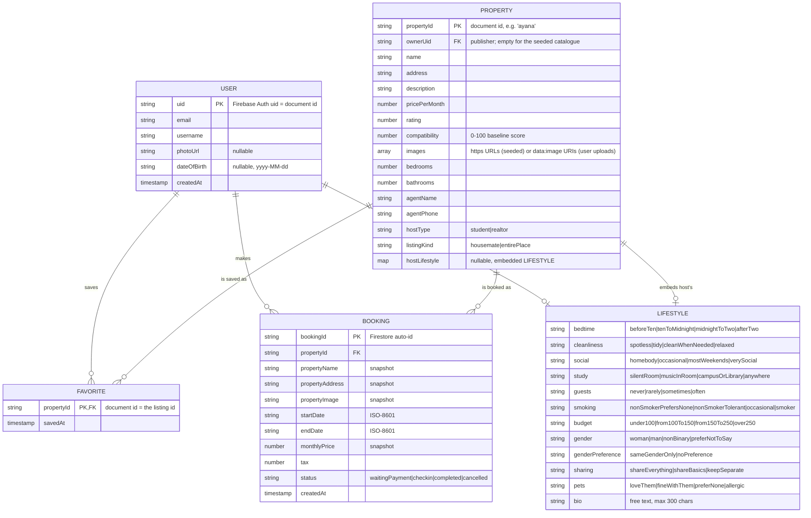

# Houseslice — Database Design (Firestore)

This document is the authoritative description of the Houseslice data model.
Every collection, document id, and field name below matches the code exactly —
see [`property_model.dart`](../lib/features/property/data/models/property_model.dart),
[`booking_model.dart`](../lib/features/booking/data/models/booking_model.dart),
and [`user_model.dart`](../lib/features/auth/data/models/user_model.dart).

## Entity–relationship diagram



## Collection layout

| Path | Document id | Owner | Purpose |
|---|---|---|---|
| `properties/{propertyId}` | slug (`ayana`, …) or auto-id | the publisher (`ownerUid`) | The marketplace listings |
| `users/{uid}` | Firebase Auth uid | that user | Profile |
| `users/{uid}/favorites/{propertyId}` | the listing id | that user | Hearted listings |
| `users/{uid}/bookings/{bookingId}` | Firestore auto-id | that user | Bookings |

Per-user data is nested **under** `users/{uid}` rather than kept in top-level
collections with a `userId` field. That makes ownership a property of the path,
so a single rule (`request.auth.uid == uid`) secures every subcollection and
there is no way to query across users at all.

### Where the lifestyle answers live

`LIFESTYLE` is not its own collection. It appears in two places, both embedded:

- **On the device** — the signed-in student's own answers, stored as a single
  JSON string under `houslice.lifestyle_profile` in SharedPreferences. They are
  needed on every listing card, so a network round trip per card would be
  wasteful, and they are not sensitive enough to require server storage.
- **Inside a housemate listing** — the host's answers, embedded as a map on the
  property document. Embedding rather than referencing means a browser scores a
  listing from one read, and a host editing their own profile later does not
  silently rewrite the compatibility of listings other students have already
  viewed.

`hostLifestyle` is null for `entirePlace` listings — there is no housemate to
be compatible with — and for rooms whose host has not taken the questionnaire.

### Relationships

- **USER → FAVORITE** (1-to-many). The favourite's *document id is the listing
  id*, which makes the relationship the key itself: writing a favourite twice is
  idempotent, and no `propertyId` field is needed inside the document.
- **USER → BOOKING** (1-to-many).
- **PROPERTY → FAVORITE / BOOKING** — a logical foreign key. Firestore has no
  referential integrity, so this is enforced in the app layer.

## On duplicated data

`BOOKING` intentionally stores `propertyName`, `propertyAddress`,
`propertyImage`, and `monthlyPrice` alongside the `propertyId`. This is a
deliberate **snapshot**, not accidental duplication:

1. A booking is a financial record. If a host later edits the listing's price or
   renames it, past bookings must still show what was actually agreed.
2. Rendering the My Bookings list would otherwise need an extra read per row.

Everything else is stored exactly once. Notably, favourites hold no copy of the
listing, and the profile holds no copy of the auth record beyond `email`, which
Firebase Auth owns and the rules pin as immutable after creation.

## Security rules

Full rules: [`firestore.rules`](../firestore.rules). Summary of what they enforce:

| Path | Read | Write |
|---|---|---|
| `properties/{id}` | any signed-in user | create only as yourself (`ownerUid == auth.uid`); edit/delete only your own; `ownerUid` immutable; the same field checks apply to create and update |
| `users/{uid}` | owner only | owner only; `email` immutable after create; `username` ≥ 3 chars |
| `users/{uid}/favorites/{id}` | owner only | owner only; body must be exactly `{savedAt}` |
| `users/{uid}/bookings/{id}` | owner only | owner only; on update **only `status` may change** |
| anything else | denied | denied |

Two properties worth calling out:

- **Nothing is readable while signed out.** There is no public path.
- **Booking money is immutable.** The update rule uses
  `diff(resource.data).affectedKeys().hasOnly(['status'])`, so a client cannot
  rewrite `monthlyPrice` or the dates on a confirmed stay — only move it through
  the status lifecycle.

## Indexes

See [`firestore.indexes.json`](../firestore.indexes.json). Single-field indexes
are automatic; the composite ones cover filtering bookings by `status` while
ordering by `startDate` (the Upcoming / Completed / Cancelled tabs).

## Seeding the catalogue

Because `properties` denies all client writes, the catalogue must be loaded once
by an administrator rather than by the app:

```sh
firebase firestore:import ./seed        # or paste the documents in the console
firebase deploy --only firestore:rules,firestore:indexes
```

The listing data lives in
[`seed_properties.dart`](../lib/features/property/data/seed_properties.dart).

> **Known limitation.** `FirestorePropertyDataSource._seed()` still attempts a
> client-side batch write when it finds the collection empty. Under these rules
> that write is denied. Either seed the catalogue before first run (recommended,
> and what the rules assume), or temporarily relax the `properties` write rule
> while seeding and restore it afterwards.
