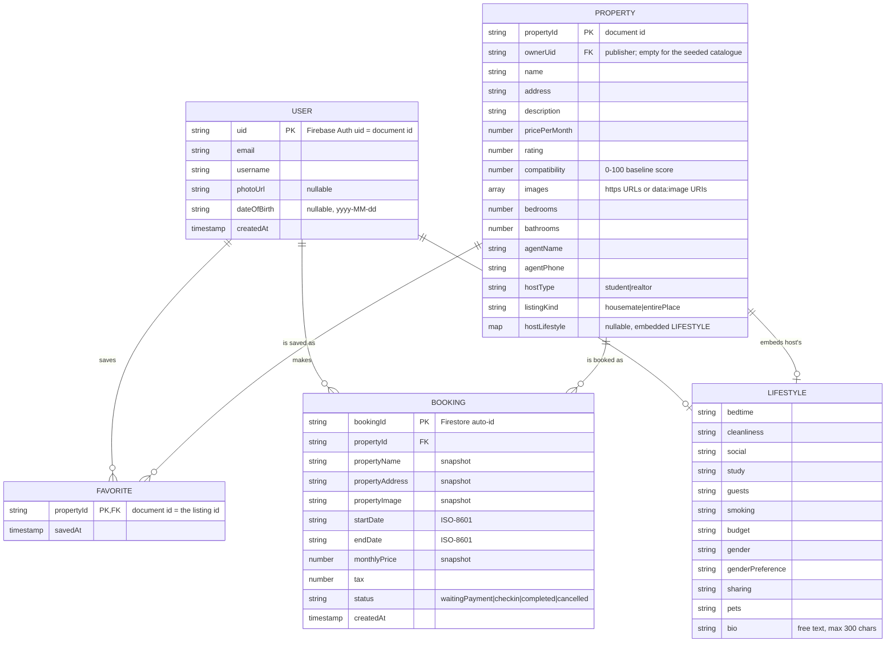

# GROUP 22 SUMMATIVE PROJECT — HOUSESLICE

## MOBILE APPLICATION IN FLUTTER

**SOFTWARE ENGINEERING — GROUP 22 SUMMATIVE**
**AFRICAN LEADERSHIP UNIVERSITY, KIGALI, RWANDA**

**NAME OF FACILITATOR**
[INSERT FACILITATOR NAME]

**July, 2026**

---

> **Note for the team — not part of the submission.** This file is the source of
> truth for the report. Regenerate the PDF after any edit with
> `python tool/build_report.py`, which applies Times New Roman 12 pt body and
> 14 pt headings, embeds the screenshots and writes
> `docs/Group22_Final_Project_Submission.pdf`.
>
> Markers written as **[INSERT …]** need something only the team can supply — a
> link, a screenshot, or content from the research half of the report. They are
> highlighted in the PDF and listed in Appendix A so none is missed.

---

# GROUP ACTIVITIES

**DEMO VIDEO LINK:** [INSERT YOUTUBE LINK]

**GITHUB LINK:** https://github.com/davidmuo/houslice

**GROUP CONTRIBUTION TRACKER:**
https://docs.google.com/spreadsheets/d/16b-F2xQTA7ibsE82j9-ib44QQZ1xNCI8RiYPUROfOGE/edit?gid=0#gid=0

**FIGMA DESIGN:**
https://www.figma.com/design/p19brWS9LFrF2hCMMt7IHc/houseslice?node-id=0-1

**FIGMA PROTOTYPE:**
https://www.figma.com/proto/p19brWS9LFrF2hCMMt7IHc/houseslice?node-id=0-1

| S/N | Group Member | Role | Attendance | Commits | Contribution |
|---|---|---|---|---|---|
| 1 | Aime Ndayambaje | Authentication lead | 24–31 July 2026 | 39 | Built the entire authentication feature: the `AppUser` entity, `AuthRepository` contract, `AuthBloc` with its events and states, and the `SignIn`, `SignUp`, `SignOut`, `GetCurrentUser` and `ChangePassword` use cases. Implemented `FirebaseAuthDataSource` and `MockAuthDataSource`, and built the Register, Sign In, New Password and Social Buttons screens. Also established the project tooling (`analysis_options.yaml`, `.gitignore`, `.metadata`, `pubspec.yaml`) and contributed authentication test suites. |
| 2 | Isimbi Nelly | App infrastructure and testing lead | 22–31 July 2026 | 10 | Wired the application together: `main.dart`, `app.dart`, the `get_it` injection container and `firebase_options.dart`. Built the theme system and shared widget library, the router and `ToggleCubit`, and the error-handling core (`Failure`, `Result`, the `UseCase` base class, validators and formatters). Delivered the onboarding, notifications and profile features, and authored the auth, lifestyle, booking, property and shell test suites. |
| 3 | Nkuba Junior Igiraneza | Booking module lead | 21–30 July 2026 | 10 | Delivered the booking feature end to end: the `Booking` entity and repository contract, `BookingModel` with its Firestore and mock data sources, `BookingRepositoryImpl`, the `GetBookings`, `CreateBooking` and `CancelBooking` use cases, `BookingBloc` and `BookingFormCubit`, the Booking and My Bookings screens, and the booking widgets (success sheet, booking tile, review sheet, date sheet). Also built `NavCubit` and `MainShell`, and configured the iOS Xcode project. |
| 4 | Gift Don-Emmanuel | Property module lead | 23–30 July 2026 | 6 | Delivered the property feature end to end across all three layers: domain (`Property` entity, repository contract, and the `GetProperties`, `SearchProperties` and `ToggleFavorite` use cases), data (`PropertyModel`, the seed catalogue, Firestore and mock data sources, `PropertyRepositoryImpl`) and presentation (`PropertyBloc`, `SearchCubit`, the Home, Explore, Search, Favorites and Details screens, the property card and share sheet). Also contributed the iOS platform files. |
| 5 | Muotoh-Francis David | Matching, listings, backend configuration and documentation | 19–31 July 2026 | 51 | Built the lifestyle questionnaire feature across all three layers and the `CompatibilityScorer` that powers the match percentage and the "Why?" breakdown. Built the create-listing flow, the `PhotoService` and picker, the settings feature with persisted preferences, and listing edit and delete ("My Listings"). Configured the Firebase project, authored `firestore.rules` and `firestore.indexes.json`, set up the Android platform, and wrote the README, the ERD and this report. |

**A note on team composition.** The team's earlier *User Research and Prototype
Design Report* was authored by four members. Aime Ndayambaje joined for the
implementation phase and led the authentication feature; his commit history runs
from 24 July. The attendance column above reflects each member's actual first
and last commit dates rather than a uniform project window.

**A note on commit counts.** Commit count and contribution volume are not the
same measure, and the table reports both rather than smoothing the difference.
Gift's six commits, for instance, delivered the whole property module — the
largest single feature in the application — because that work was committed in a
small number of layer-sized commits, whereas members who committed more
incrementally accumulated higher counts for comparable work. Feature ownership,
in the right-hand column, is the more meaningful measure, and every claim in it
can be verified against the repository with `git log --author="<name>"`.

---

# ABSTRACT

The aim of this project was to develop **Houseslice**, a mobile application
built with the Flutter framework and backed by Google Firebase. Flutter is a
cross-platform toolkit that allows a single Dart codebase to target Android and
iOS (Flutter Documentation, 2024).

The tools and methodologies applied include Flutter, Firebase Authentication,
Cloud Firestore, the BLoC (Business Logic Component) pattern for state
management, Clean Architecture for code organisation (Martin, 2017), and Agile
with Scrum for project management (Schwaber & Sutherland, 2020).

Houseslice addresses a specific problem in Kigali's student housing market:
students searching for accommodation and housemates rely on unmoderated Facebook
groups and WhatsApp chains, where anyone can post, nothing is verified, and there
is no reliable way to tell a fellow student from a letting agent. The
application responds with a **verified, student-only marketplace** gated behind
university email domains. Its distinguishing feature is a **lifestyle
compatibility engine**: students answer an eleven-question lifestyle
questionnaire, and every shared-home listing then displays a live match
percentage together with a breakdown explaining that score across nine
dimensions. The application also supports publishing, editing and deleting
listings, a booking flow with a range calendar and price breakdown, per-user
favourites, and preferences that persist across restarts.

---

# CONTENTS

1. Introduction — 1.1 Objectives · 1.2 Contributions
2. Application Design — 2.1 Application Features · 2.2 Overview of UI
3. Relevant Technologies — 3.1 Flutter Framework · 3.2 BLoC and Clean Architecture · 3.3 Google Firebase · 3.4 Supporting Packages
4. Methodology — 4.1 Project Methodology · 4.2 Development Process and Tools · 4.3 Disclosure of AI Assistance
5. Implementation — 5.1 Project Structure · 5.2 State Management in Practice · 5.3 Database Design · 5.4 Firebase Security Rules · 5.5 CRUD Operations · 5.6 Authentication · 5.7 User Preferences
6. Testing
7. Setup Instructions
8. Known Limitations and Future Work
9. Conclusion
10. References
11. Appendix A — Outstanding Insertions

---

# LIST OF FIGURES

| Figure | Title | Source |
|---|---|---|
| 1 | Registration screen with university-email validation | `docs/screenshots/01-register.png` |
| 2 | Lifestyle questionnaire | `docs/screenshots/02-quiz.png` |
| 3 | Home feed with compatibility scores and host badges | `docs/screenshots/03-home.png` |
| 4 | Listing details screen | `docs/screenshots/04-details.png` |
| 5 | "Why are we compatible?" breakdown sheet | `docs/screenshots/05-why-compatible.png` |
| 6 | Explore grid | `docs/screenshots/06-explore.png` |
| 7 | Favourites | `docs/screenshots/07-favorites.png` |
| 8 | My Bookings across status tabs | `docs/screenshots/08-bookings.png` |
| 9 | Profile | `docs/screenshots/09-profile.png` |
| 10 | Settings in light theme | `docs/screenshots/10-settings-light.png` |
| 11 | Settings in dark theme | `docs/screenshots/11-settings-dark.png` |
| 12 | Entity–relationship diagram | Section 5.3 |
| 13 | My Listings with edit and delete | `docs/screenshots/15-my-listings.png` |
| 14 | Firestore console showing a document written by the app | `docs/screenshots/16-firestore-console.png` |
| 15 | `flutter analyze` reporting zero issues | `docs/screenshots/12-analyze.png` |
| 16 | `flutter test` — 303 tests passing | `docs/screenshots/13-tests.png` |
| 17 | Test coverage by feature area | `docs/screenshots/14-coverage.png` |

---

# 1. INTRODUCTION

## 1.1 Objectives

The objective of this project is to develop Houseslice, a mobile application
that helps university students in Kigali find accommodation and compatible
housemates inside a trusted, verified community.

To achieve this, the project focuses on building a cross-platform mobile
application in Flutter, ensuring the interface matches the team's Figma
prototype and behaves correctly across device sizes and orientations. Firebase
Authentication manages accounts through two independent sign-in methods, and
Cloud Firestore stores listings, bookings, favourites and profiles behind
security rules that restrict every document to its owner.

Beyond the mechanics of listing and booking, the project sets out to solve a
matching problem rather than only a search problem. Existing channels help a
student find *a room*; Houseslice aims to help them find *the right room and the
right housemate*, by modelling lifestyle compatibility explicitly and explaining
it rather than presenting an opaque score.

These objectives extend the five set out in the team's earlier User Research
and Prototype Design report:

1. Understand how university students in Kigali currently search for housing and
   identify the points of greatest friction in that process.
2. Identify the trust, safety and compatibility concerns that drive student
   housing decisions.
3. Design a verified, student-only housing platform that responds to those
   concerns through evidence-based product decisions.
4. Translate user research findings into an interactive prototype demonstrating
   the platform's core flows.
5. Position the platform within a sustainable income model that can scale to
   other African university hubs.

Objective 4 produced the Figma prototype linked above. **This report covers the
sixth objective: implementing that prototype as a working Flutter application
backed by Firebase.**

## 1.2 Contributions

The problem this application addresses was established through primary research
documented in the team's *User Research and Prototype Design Report*, in which
ten students were interviewed across the African Leadership University, the
University of Rwanda and the Adventist University of Central Africa. The cohort
comprised six international students from Burundi, Uganda, Kenya, Nigeria and
Ghana, and four Rwandan students, with six female and four male participants
spanning first-year arrivals through final-year students with sublet experience.

**Problem statement.** University students in Kigali need a reliable,
student-focused way to find safe and affordable accommodation, compatible
housemates and flexible short-term housing, because current search methods are
unverified, fragmented across informal platforms, and provide limited information
about housing quality, housemate compatibility and neighbourhood safety.

Four findings from that research directly determined what was built, and each
one is traceable to a specific feature in this implementation:

| Research finding | Implemented as | Section |
|---|---|---|
| Trust was the dominant concern; students named scams, misleading listings and unverified landlords as their main source of anxiety | University-domain-gated authentication with email verification, and a Student/Realtor badge on every listing | 5.6, 2.1 |
| Housemate compatibility — particularly cleanliness, sleep schedule and study habits — predicts satisfaction more consistently than price | An eleven-question lifestyle questionnaire and a compatibility engine that explains its score across nine dimensions | 2.1, 5.2 |
| A structural gap in short-term housing: students pay for empty rooms during internships and breaks | A dual listing model, where a student publishes a room for a defined window and a browsing student books it on a range calendar | 2.1, 5.5 |
| Students shared personal phone numbers in public groups because no safer channel existed | Contact details are held on the listing document behind authenticated reads rather than posted publicly | 5.3, 5.4 |

The literature supports the compatibility finding directly: Erb et al. (2014)
report that mismatched roommates are a leading cause of conflict and reduced
academic performance, while positive roommate relationships correlate with
stronger academic outcomes. Nielsen (2019) similarly identifies identity
verification and reliable review systems as the determinants of trust in online
marketplaces, which is the reasoning behind gating the platform on university
email rather than opening it to any account.

The competitor analysis in that report examined the Facebook and WhatsApp ALU
Housing Group, Airbnb Kigali, House Rwanda and Roomster against ten criteria,
and found that none combined student verification, housemate matching and
short-term sublet support. That gap is what this application implements.

## What this report adds

The research report ended at an interactive Figma prototype. This report covers
what happened next: translating that prototype into a working Flutter
application backed by Firebase. From a technical standpoint, the project
contributes a working reference for several practices the course emphasises:

- A **Clean Architecture** Flutter codebase in which the domain layer imports
  nothing from Flutter or Firebase, so business rules are independently
  testable.
- A **compatibility scoring engine** implemented as a pure domain service with
  no dependency on the UI or the backend, and therefore fully unit-testable.
- **Security rules written alongside the features they protect**, so that what
  the interface offers and what the backend permits cannot drift apart.
- A **responsive-layout regression suite** that asserts every screen lays out
  without overflow at three viewport sizes, catching a class of defect that
  manual testing in portrait consistently misses.

---

# 2. APPLICATION DESIGN

## 2.1 Application Features

**Onboarding.** A branded splash screen, three introduction slides and a
location chooser. Whether the introduction appears is stored as a preference, so
returning students go straight to sign-in.

**Authentication.** Two independent methods — university email and password, and
Google Sign-In. Both are gated to allowed university domains
(`alustudent.com`, `alueducation.com`, `ur.ac.rw`, `auca.ac.rw`), so a personal
Gmail account cannot get in even through the Google flow. The feature includes
email verification, a password-reset flow and a change-password screen.
Registration validates every field before any network call is made, and shows a
specific message rather than a generic failure (Figure 1).

**Lifestyle questionnaire.** Eleven questions plus a free-text introduction,
covering bedtime, cleanliness, social life, study habits, guests, smoking,
budget, gender and gender preference, sharing style and pets (Figure 2).

**Compatibility matching.** Every shared-home listing displays a live match
percentage computed against the student's own answers. Tapping **"Why?"** opens
a breakdown across nine dimensions, each with a sentence explaining what the
score means (Figure 5). This is the application's distinguishing feature: the
score is explained rather than asserted.

**Student and realtor badges.** Every listing states at a glance whether it came
from a fellow student or a letting agent (Figure 3).

**Publishing, editing and deleting a listing.** Students sublet a room; agents
post a whole property. Selecting "Realtor" automatically forces "Entire place",
because an agency has no lifestyle profile to match against. **My Listings**
shows everything the signed-in student has published, with edit and delete
actions on each row (Figure 13).

**Explore and search.** Grid browsing, live search with Recent and Result
sections, and a "Search not found" empty state (Figure 6).

**Listing details.** A photo gallery with thumbnails, an about section, a
verified-host card and a share sheet (Figure 4).

**Favourites.** Per-user, synchronised to Firestore, with an optimistic heart
toggle so the interface responds instantly (Figure 7).

**Booking.** A custom range calendar, payment-method selection (card or mobile
money), an Add Card screen with Luhn checksum and expiry validation, a price
breakdown with tax, and a success sheet. A student cannot hold two active
bookings for the same property — a second attempt is refused with an
explanation — while a property whose previous stay was completed or cancelled
can be booked again.

**My Bookings.** Upcoming, Completed and Cancelled tabs with status chips, a
write-review sheet, a call-agent action and illustrated empty states (Figure 8).
Tapping a booking opens the listing it is for, and any booking that has not yet
happened can be cancelled after a confirmation prompt.

**Settings.** Four preferences persisted across restarts: colour theme
(system, light or dark), notification opt-in, preferred Kigali district, and
whether onboarding has been seen (Figures 10 and 11).

**Profile.** Edit profile, change password, notifications, about and sign out
(Figure 9).

## 2.2 Overview of UI

The interface was implemented directly from the team's Figma prototype. A fixed
bottom navigation bar switches between Home, Explore, Favourites, Bookings and
Profile, and every other screen is reached through named routes handled by a
central router, so navigation never leaves the back stack in an inconsistent
state.

The application ships light and dark themes, both defined centrally in
`AppTheme`. Colour choices were checked against the WCAG 2.1 AA contrast
requirement of 4.5:1 for body text (W3C, 2018); the dark palette records its
measured ratios in `app_colors.dart` — `darkText` at approximately 15.8:1,
`darkGrey` at 7.4:1 and the primary accent at 6.9:1 against the dark background.

Layout responsiveness is verified automatically rather than by eye. Every
argument-free screen is pumped at 320×568, 430×932 and 932×430 and asserted to
lay out without a `RenderFlex` overflow — see Section 6.

---

# 3. RELEVANT TECHNOLOGIES

## 3.1 Flutter Framework

Flutter is an open-source UI toolkit developed by Google for building
applications for Android, iOS, web and desktop from a single codebase. It uses
the Dart language and provides a large library of composable widgets (Flutter
Documentation, 2024).

Flutter's hot reload was the single biggest contributor to development speed on
this project: interface changes appear on the device in under a second, which
turned translating the Figma prototype into widgets into an iterative process
rather than a compile-and-wait one.

Flutter's widget composition model also made the compatibility feature
straightforward to express. The match percentage, its colour band and the
explanation sheet are separate stateless widgets driven from a single state
object, so the same score is presented consistently on the home feed, the
explore grid and the details screen without duplicated logic.

## 3.2 BLoC Design Pattern and Clean Architecture

The BLoC pattern separates business logic from the user interface. A BLoC
receives *events* and emits *states*; the UI dispatches events and rebuilds in
response to states, and never performs business logic itself (Angelov, 2024).

A **Cubit** is the simplified form of the same idea: it exposes methods instead
of events and emits states directly. Houseslice uses both, choosing between them
deliberately:

- **BLoC** where an action has a meaningful, auditable event history —
  authentication, listings and bookings.
- **Cubit** where the state is a simple value with no event semantics worth
  recording — form state, questionnaire progress, tab selection, preferences.

This sits on top of **Clean Architecture** (Martin, 2017), which organises each
feature into three layers under a strict dependency rule:

```
presentation  →  domain  ←  data
```

The **domain** layer sits at the centre and depends on nothing. It holds
entities, repository contracts and use cases, and imports neither Flutter nor
Firebase. The **data** layer implements the domain's contracts against a
concrete backend. The **presentation** layer holds BLoCs, Cubits, pages and
widgets.

The practical consequence is testability. `CompatibilityScorer` is a plain Dart
class in the domain layer, so its unit tests need no widget tree, no Firebase
emulator and no mocking framework. Equally, replacing Firestore with another
backend would mean rewriting only the data layer.

**`setState` is not used for business logic anywhere in the codebase.** The few
remaining occurrences manage ephemeral UI state that no other widget observes —
a photo-picker spinner, a "read more" expansion toggle, a text-controller
listener — which is what `setState` is actually for.

Use cases return a `Result<T>` — either `Success(value)` or `Err(Failure)` —
rather than throwing. Exceptions are caught at the data-layer boundary and
converted, so a BLoC never sees a `FirebaseException` and the presentation layer
never sees a data-layer type.

## 3.3 Google Firebase

Firebase provides the backend, through two services.

**Firebase Authentication** manages accounts for both sign-in methods. It
handles credential storage, session persistence across application restarts,
email verification links and password-reset emails, none of which the team had
to implement (Firebase Documentation, 2024).

**Cloud Firestore** is the NoSQL document database holding listings, profiles,
favourites and bookings. Its document and collection model suited the data
naturally: per-user data is nested *under* the user document rather than kept in
top-level collections with a `userId` field, which makes ownership a property of
the document path and therefore straightforward to secure (Section 5.4).

Firestore security rules are declarative and evaluated server-side, so they
cannot be bypassed by a modified client (Firebase Security Rules Documentation,
2024).

## 3.4 Supporting Packages

| Package | Purpose |
|---|---|
| `flutter_bloc` | BLoC and Cubit state management |
| `equatable` | Value equality for states and entities |
| `get_it` | Dependency injection and service location |
| `firebase_core`, `firebase_auth`, `cloud_firestore` | Backend services |
| `google_sign_in` | Second authentication method |
| `image_picker` | Selecting listing photos from the device gallery |
| `shared_preferences` | Persisted user preferences |
| `google_fonts`, `intl` | Typography and date/currency formatting |
| `bloc_test`, `mocktail` | State-machine assertions and test doubles |

---

# 4. METHODOLOGY

## 4.1 Project Methodology

The team used **Agile with Scrum** (Schwaber & Sutherland, 2020). Work was
organised into short iterations, each ending with a working application rather
than an isolated component.

This mattered on a project with five contributors and interdependent modules.
Because the interfaces between layers were agreed first — repository contracts
and entity shapes — members could build the property, booking, authentication
and lifestyle modules in parallel without blocking one another. A module could
be developed against its contract before the layer beneath it existed.

Feature ownership was assigned per module, which is visible directly in the Git
history: each member's commits cluster around their module, and each module was
developed on its own branch before being merged into `main`.

## 4.2 Development Process and Tools

**Version control.** GitHub, with a branch per feature —
`feature/property-module`, `feature/booking-domain`, `features/auth`,
`feature/app-shell`, `feature/ios-platform`, `feature/android-platform`,
`feature/test-suites` and `feature/listing-management` — merged into `main`.

**Development environment.** Visual Studio Code and Android Studio with the
Flutter and Dart extensions. `flutter doctor -v` was used to verify that each
member's environment matched.

**Quality gates.** Three commands were run before any merge:

```sh
dart format lib test         # consistent formatting
flutter analyze lib test     # zero static analysis issues
flutter test                 # the full suite must pass
```

**Design.** Figma for the prototype, which the implementation follows screen by
screen.

## 4.3 Disclosure of AI Assistance

In line with the assessment's academic-integrity requirements, the team
discloses the following use of AI tools.

**What AI was used for.** An AI coding assistant was used as a reviewing and
debugging aid during development, in three specific ways.

1. **Code review before merge.** The assistant reviewed diffs and identified
   defects that the team then verified and fixed. Five are worth naming because
   they were real: two `RenderFlex` overflow errors visible only in landscape
   orientation (134 px on the location chooser, 34 px on the create-password
   form); a demo-mode data source that stamped a hardcoded owner identifier, so
   a newly registered account's listing never appeared under My Listings; an
   error-handling flaw in which a failed favourites cleanup reported an
   already-successful delete as failed; and an edit path that could overwrite a
   listing's stored lifestyle data with an empty profile.
2. **Test scaffolding.** The assistant helped write the responsive-layout suite
   and parts of the listing-management tests. Every test was reviewed and run by
   the team, and the suite passes in full.
3. **Documentation drafting.** Portions of this report and the README were
   drafted with AI assistance and then edited by the team for accuracy.

**What AI was not used for.** The application's architecture, the compatibility
scoring model, the database design, the Firebase security rules and the Figma
prototype are the team's own work. The research half of this report — problem
statement, literature review, personas, competitor analysis and journey mapping
— was produced by the team without AI generation.

**Estimated proportion.** AI-assisted content is estimated at **under 40%** of
the submitted work, concentrated in review, test scaffolding and documentation
drafting rather than in design decisions or original analysis. All AI-suggested
code was read, understood and verified before being committed, and the team is
able to explain every line of the codebase on request.

---

# 5. IMPLEMENTATION

## 5.1 Project Structure

Code is organised by feature, and each feature by layer. No source file sits
loose in `lib/`.

```
lib/
├── main.dart                 # Firebase bootstrap, preference preload
├── app.dart                  # MaterialApp + global bloc providers
├── injection_container.dart  # get_it dependency graph
├── firebase_options.dart     # generated by flutterfire configure
├── core/                     # theme, errors, Result, use case base,
│                             # validators, formatters, shared widgets, router
└── features/
    ├── auth/                 # email/password + Google, reset, verification
    │   ├── domain/           # entities, repository contracts, use cases
    │   ├── data/             # models, data sources, repository impl
    │   └── presentation/     # bloc, cubit, pages, widgets
    ├── lifestyle/            # questionnaire, compatibility scoring
    ├── onboarding/           # splash, intro slides, location picker
    ├── property/             # listings, search, favourites, create/edit
    ├── booking/              # checkout, calendar, payment, my bookings
    ├── settings/             # persisted preferences
    ├── notifications/
    ├── profile/
    └── shell/                # bottom-navigation main shell
```

Every feature repeats the same `domain / data / presentation` split, so a
developer who learns one feature's layout knows them all.

## 5.2 State Management in Practice

| Concern | Solution |
|---|---|
| Auth session, sign in/up/out, Google, profile, verification | `AuthBloc` |
| Password reset flow | `PasswordResetCubit` |
| Listings, favourites, delete | `PropertyBloc` |
| Publishing and editing a listing | `CreateListingCubit` |
| Search results and recents | `SearchCubit` |
| Bookings (load, create, cancel) | `BookingBloc` |
| Checkout form (dates, payment method) | `BookingFormCubit` |
| Lifestyle answers (application-wide) | `LifestyleCubit` |
| Questionnaire progress | `QuizCubit` |
| User preferences | `PreferencesCubit` |
| Small UI state (tabs, toggles, gallery index) | `ToggleCubit` / `IndexCubit` |

Three decisions in this table are worth defending, because they are the kind of
thing a reviewer may ask about during the demonstration.

**`LifestyleCubit` and `PreferencesCubit` are registered as singletons, not
factories.** Every listing card scores against the student's questionnaire
answers, and every screen renders in the chosen theme. Were these factories,
different parts of the widget tree would hold different instances and could
disagree — one screen showing a stale match percentage, or the settings screen
disagreeing with `MaterialApp` about the current theme.

**Rebuilds are scoped deliberately.** `MaterialApp` is wrapped in a
`BlocBuilder` whose `buildWhen` fires only when the *theme* preference changes,
so toggling an unrelated setting does not tear down and rebuild the entire
widget tree.

**Updates are optimistic.** Favouriting and deleting both update the interface
before the network round trip completes, then revert and show an explanatory
message if the write is rejected. This is why the heart responds instantly
rather than after a visible pause.

## 5.3 Database Design

The full entity–relationship diagram with field-level tables is in
`docs/ERD.md`. Every field name below matches the code exactly.

**Figure 12 — Entity–relationship diagram**



**Collection layout.**

| Path | Document id | Owner |
|---|---|---|
| `properties/{propertyId}` | slug or auto-id | the publisher (`ownerUid`) |
| `users/{uid}` | Firebase Auth uid | that user |
| `users/{uid}/favorites/{propertyId}` | the listing id | that user |
| `users/{uid}/bookings/{bookingId}` | Firestore auto-id | that user |

**Three design decisions.**

*Per-user data is nested under `users/{uid}`* rather than kept in top-level
collections with a `userId` field. Ownership therefore becomes a property of the
document path, so a single rule (`request.auth.uid == uid`) secures every
subcollection, and cross-user queries are impossible by construction rather than
by convention.

*A favourite's document id is the listing id*, which makes the relationship the
key itself. Writing a favourite twice is idempotent, and the document body needs
no `propertyId` field at all — only `savedAt`.

*Bookings deliberately duplicate listing data.* `propertyName`,
`propertyAddress`, `propertyImage` and `monthlyPrice` are stored on the booking
alongside `propertyId`. This is a **snapshot**, not accidental denormalisation:
a booking is a financial record, and if a host later edits their listing's
price, past bookings must still show what was actually agreed. It also avoids an
extra read per row when rendering My Bookings. Everything else in the schema is
stored exactly once.

**Indexes.** `firestore.indexes.json` declares composite indexes for filtering
bookings by `status` while ordering by `startDate` — the query behind the
Upcoming, Completed and Cancelled tabs. Single-field indexes are omitted because
Firestore maintains them automatically and rejects explicit declarations at
deploy time.

## 5.4 Firebase Security Rules

The rules live in `firestore.rules` and are deployed to the live project.

| Path | Read | Write |
|---|---|---|
| `properties/{id}` | any signed-in user | create only as yourself (`ownerUid == auth.uid`); edit and delete only your own; `ownerUid` immutable; field validation applied to both create and update |
| `users/{uid}` | owner only | owner only; `email` immutable after creation; `username` at least 3 characters |
| `users/{uid}/favorites/{id}` | owner only | owner only; body must be exactly `{savedAt}` |
| `users/{uid}/bookings/{id}` | owner only | owner only; on update **only `status` may change** |
| anything else | denied | denied |

Five properties are worth stating explicitly, because each defends against a
specific attack rather than being generic boilerplate.

**1. Nothing is readable while signed out.** There is no public path. A
catch-all `match /{document=**} { allow read, write: if false; }` closes
anything not explicitly matched above it.

**2. A listing cannot be hijacked or handed over.** Creation requires
`incoming().ownerUid == request.auth.uid`, so a student cannot publish in
someone else's name. Update additionally requires
`incoming().ownerUid == resource.data.ownerUid`, making ownership immutable: a
listing cannot be transferred, and someone else's cannot be claimed.

**3. Create and update share the same validation.** A `validListing()` helper
checks that `name` is a non-empty string, `pricePerMonth` is a positive number,
and `hostType` and `listingKind` hold permitted values. Both `create` and
`update` call it, so an edit cannot write a document that would have been
rejected as a new listing — a gap that existed until it was found in review.

**4. Booking money is immutable.** The update rule uses
`request.resource.data.diff(resource.data).affectedKeys().hasOnly(['status'])`,
so a client can move a booking through its status lifecycle but cannot rewrite
`monthlyPrice`, `tax` or the dates of a stay that has already been agreed.

**5. Verification status cannot be forged.** `emailVerified` is deliberately
*never* persisted to Firestore. It is read from the Firebase Auth token on every
load, so writing to one's own profile document cannot manufacture a verified
badge.

Critically, **the interface offers exactly what the rules permit**. My Listings
decides which rows to show using `ownerUid` — the same field the rules check —
so a student is never shown an Edit button for a listing the backend would
refuse to let them edit.

## 5.5 CRUD Operations

All four operations are exercised against Cloud Firestore from the front end.

| Operation | Where it happens |
|---|---|
| **Create** | Publish a listing; create a booking; favourite a listing; create a profile on registration |
| **Read** | Load the catalogue; search; load bookings; load favourites; load profile |
| **Update** | Edit a published listing; cancel a booking (status transition); edit profile; change password |
| **Delete** | Delete a published listing; unfavourite a listing |

Every operation updates the interface immediately and reports failure through a
`SnackBar` rather than failing silently. Favouriting and deletion are optimistic:
the change appears at once and is reverted, with an explanatory message, if the
backend rejects it.

Figure 14 shows the Firestore console immediately after a listing was published
from the application, and four details in it are worth pointing out because each
corroborates a claim made elsewhere in this report.

**`ownerUid` is set to the publishing student's Firebase Auth UID.** This is the
field every rule in Section 5.4 is written against, and the field My Listings
filters on — which is what keeps the interface and the security rules in
agreement.

**`images[0]` begins `data:image/jpeg;base64,`.** This is the inline photo
storage described in Section 8: the photo was chosen from the device gallery,
compressed, and embedded on the document itself rather than uploaded to Cloud
Storage, which the project's billing plan does not include.

**The host's lifestyle answers are embedded on the listing**, visible as
`sharing`, `smoking`, `social`, `study` and `pets`. This is the denormalisation
decision from Section 5.3: embedding rather than referencing means a browsing
student scores the listing from a single read.

**`rating` is 0.** A newly published listing has earned no reviews yet, and an
edit deliberately preserves this value rather than resetting it — the behaviour
covered by the `CreateListingCubit` tests.

## 5.6 Authentication

Two independent methods are implemented, and both work against the live Firebase
project.

**Email and password.** Registration validates the email format, restricts the
domain to a supported university, and requires a username of at least three
characters and a password of at least six. On success a verification email is
sent immediately and a profile document is created at `users/{uid}`.

**Google Sign-In.** The Google account's email is checked against the same
university domain list *before* a Firebase session is created, and the Google
session is dropped if the check fails — so a personal Gmail account cannot enter
through the social route. On first sign-in a profile document is created; on
subsequent sign-ins the existing profile is left intact.

**Security features implemented:**

- **Email verification** sent on registration and re-sendable from the profile.
- **Input validation** on every field, so blank or malformed input is rejected
  before any network call is made.
- **Domain gating** on *both* methods.
- **Password reset** by email, which deliberately does not reveal whether an
  address is registered: a `user-not-found` error returns silently rather than
  confirming that the account does not exist.
- **Session persistence.** The session survives an application restart, and
  signing out clears the Google session as well as the Firebase one, so the next
  sign-in shows the account picker instead of silently reusing the last account.

**Error messages are specific rather than generic.** Firebase error codes are
mapped to sentences a student can act on — "Incorrect email or password", "An
account already exists with this email. Sign in instead", "No internet
connection. Check your network", "Too many attempts. Try again in a moment" —
rather than surfacing a raw exception.

## 5.7 User Preferences

Five values persist on the device through `shared_preferences` and are restored
*before the first frame is drawn*, so the application opens directly in the
student's chosen theme rather than flashing the default one:

1. **Colour theme** — system, light or dark.
2. **Notification opt-in.**
3. **Preferred Kigali district**, used to pre-filter listings.
4. **Onboarding seen**, so returning students skip the intro slides.
5. **Lifestyle questionnaire answers**, which are needed on every listing card
   and would otherwise cost a network round trip per card.

---

# 6. TESTING

```sh
flutter analyze lib test   # 0 issues
flutter test               # 303 tests, all passing
flutter test --coverage    # 74.6% line coverage (3,745 / 5,022 lines)
```

The suite covers validators, formatters, entities, models, data sources,
repositories, BLoCs and Cubits, and every screen — including the modal sheets.

**Widget tests run against the real dependency graph in demo mode** rather than
against mocked BLoCs. A single screen test therefore exercises presentation,
domain and data together, which is what makes them worth writing: a test that
renders My Listings and taps Delete really does travel through `PropertyBloc`,
the `DeleteListing` use case, the repository and the data source.

**Unit tests** cover the domain in isolation — the compatibility scorer,
validators, formatters, entity behaviour, model serialisation round-trips, and
BLoC state transitions asserted with `bloc_test`.

**Responsive-layout tests** (`test/features/responsive_layout_test.dart`) pump
every argument-free screen at three viewports — 320×568 (the smallest supported
phone), 430×932 (the design reference) and 932×430 (landscape rotation) — and
fail on any `RenderFlex` overflow.

That approach paid for itself. The widget tests exposed **ten real layout
overflow defects** that had shipped unnoticed: in the explore search bar, listing
cards, property facilities, booking tiles, the registration consent line, the
booking price row, the select-date sheet, the My Bookings segments, and finally
the location chooser (134 px in landscape) and the create-new-password form
(34 px). All are fixed, and the responsive suite is what keeps them fixed.

Static analysis reports no issues across `lib` and `test` (Figure 15), the full
suite passes (Figure 16), and coverage is reported per feature area rather than
as a single number, so gaps are visible rather than averaged away (Figure 17).

The weakest area is `features/auth` at 48.3%, and the reason is worth stating
plainly rather than hiding: `FirebaseAuthDataSource` is deliberately untested,
because exercising it would mean either mocking the entire Firebase SDK surface
or making live network calls from the test suite. The logic that sits *above* it
— `AuthBloc`, the use cases and the validators — is covered, and the data source
is exercised by hand against the live project during the demonstration.

---

# 7. SETUP INSTRUCTIONS

## Prerequisites

| Tool | Version used |
|---|---|
| Flutter SDK | 3.44.1 (stable) |
| Dart SDK | ^3.12.1 |
| Android SDK | 36.1.0 |
| Minimum Android | API 23 (required by `firebase_auth`) |

## Running the application

```sh
git clone https://github.com/davidmuo/houslice.git
cd houslice
flutter pub get
flutter run                    # debug
flutter build apk --release    # release APK, used for the demonstration
```

`lib/firebase_options.dart` is already generated for the project
`houseslice-69a7f`, so the application connects to the live backend on first
run. Firebase client keys are public identifiers rather than secrets — access is
controlled by the security rules in Section 5.4, not by hiding the key.

## Pointing at a different Firebase project

```sh
dart pub global activate flutterfire_cli
flutterfire configure --project=<your-project-id> --platforms=android,ios
firebase deploy --only firestore:rules,firestore:indexes
```

Then enable **Authentication → Email/Password** and **Google** in the Firebase
console, and register the debug SHA-1 against the Android app, or Google Sign-In
fails with `ApiException: 10`:

```sh
keytool -list -v -keystore ~/.android/debug.keystore \
  -alias androiddebugkey -storepass android
```

## Demo mode

If `firebase_options.dart` is still a placeholder, `main.dart` catches the
initialisation failure and the dependency container registers in-memory data
sources instead. The application remains fully navigable with no backend, which
is what allows the widget test suite to exercise the real dependency graph.
Demo account: `j.simmons@alustudent.com` / `password123`.

---

# 8. KNOWN LIMITATIONS AND FUTURE WORK

Being explicit about what is unfinished is more useful than implying the product
is complete.

**Listing photos are embedded in Firestore rather than held in Cloud Storage.**
Choosing photos from the device gallery *is* implemented — `PhotoService` opens
the picker, caps images at 900 px and re-encodes at quality 60. Where they land
is the compromise: Cloud Storage requires the Blaze billing plan, which this
project is not on, so `InlinePhotoService` stores each photo as a compressed
data URI on the listing document, refusing anything over 180 KB to stay clear of
Firestore's approximately 1 MiB document ceiling. A production build would swap
in `FirebasePhotoService` — already written and interface-compatible — and store
only the download URL.

**Payments are not processed.** The Add Card screen validates input with a Luhn
checksum and renders a preview, but nothing is charged and no card data leaves
the device. A real implementation would integrate a PCI-compliant processor and
MTN MoMo's API, the natural next step for the Kigali market.

**The location step is a searchable district list, not a map.** Rendering map
tiles requires the Google Maps SDK and a billable API key.

**The catalogue must be seeded by an administrator.** Because the `properties`
rules only accept listings owned by the caller, the demonstration catalogue
cannot self-seed from the client. Listings created inside the application work
normally, but a starter catalogue must be imported by an administrator.

## Researched features that did not ship

The *User Research and Prototype Design Report* proposed four core capabilities.
Two shipped in full — university email verification and the lifestyle
compatibility quiz — and the dual listing model shipped as publishing plus
calendar booking. The fourth, a trust and communication layer, shipped only
partly, and the gap is set out here rather than left for a reader to discover by
comparing the two documents.

**In-app messaging is not built.** This is the most consequential omission,
because it is the feature that directly answers the research finding that
students post personal phone numbers in public groups for want of a safer
channel. The application narrows that exposure — contact details sit on the
listing document behind an authenticated read rather than in a public post — but
narrowing exposure is not the same as removing it. Messaging remains the
highest-value next feature.

**Student-written neighbourhood guides are not built.** The research proposed
community-authored guides to Kacyiru, Kibagabaga, Remera and other
student-relevant areas. The application ships the district *filter* those guides
would have sat behind, but not the guides themselves. This was a scope decision:
guides are a content problem more than an engineering one, and would need a
moderation model the project did not have time to design.

**The navigation differs from the prototype's information architecture.** The
Figma prototype organised the application around five areas — housing search,
room listing, messaging, neighbourhood guides and profile. The built application
uses Home, Explore, Favourites, My Booking and Profile. Two of the prototype's
areas correspond to features that did not ship, and the two that replace them,
Favourites and My Booking, emerged during implementation as the screens users
actually need once booking exists. Every screen that *was* implemented follows
the prototype's visual design; the divergence is in the top-level navigation,
not in the screens themselves.

**Facebook sign-in is decorative.** Two authentication methods are implemented
and working; the Facebook button states plainly that it is unavailable rather
than pretending otherwise.

**Compatibility is one-directional.** A student sees how well a listing's host
matches *them*, but the host is not notified and cannot browse compatible
applicants. Making matching mutual is a design problem as much as an engineering
one.

## Roadmap

1. In-app messaging between verified students
2. Student-written neighbourhood guides, with a moderation model
3. Real payment capture (card and MTN MoMo)
4. Photo upload through Cloud Storage
5. Mutual, two-directional compatibility
6. Map view with real tiles
7. Expansion beyond Kigali to other African university cities

---

# 9. CONCLUSION

The development of Houseslice demonstrated how Flutter, Firebase and a
disciplined architecture combine to produce a working solution to a real problem
in the Kigali student housing market.

The technical goals were met. The application implements two independent
authentication methods with domain gating and email verification; full CRUD
against Cloud Firestore behind security rules that scope every document to its
owner; advanced state management through BLoC and Cubit with no business logic
in the UI layer; Clean Architecture with a domain layer that depends on nothing;
five preferences persisted across restarts; and a test suite of 303 tests
covering unit, widget and responsive-layout concerns at 74.6% line coverage.

Two lessons stand out. The first is that **testing found defects that inspection
did not** — ten layout overflow errors, every one of them invisible in portrait
orientation on the device the developer happened to be using, plus several logic
defects found in code review. Automating the check turned a class of bug from
"discovered by a marker" into "caught before merge".

The second is that **security rules and interface design have to be written
together**. The most valuable structural decision in the project was having My
Listings filter on `ownerUid`, the same field the security rules check, so that
the actions offered and the writes permitted cannot drift apart. Rules written
after the fact tend to be either too permissive to be useful or too strict to
work.

Houseslice is a functional, deployable prototype rather than a finished product.
With messaging, real payment capture and mutual matching, it could plausibly
serve the student community it was designed for.

---

# 10. REFERENCES

Angelov, F. (2024). *Bloc state management library: Core concepts*. Retrieved
from https://bloclibrary.dev

Dart Team. (2024). *Effective Dart: Style, documentation, usage and design*.
Retrieved from https://dart.dev/effective-dart

Firebase Documentation. (2024). *Firebase Authentication*. Google. Retrieved
from https://firebase.google.com/docs/auth

Firebase Documentation. (2024). *Cloud Firestore data model*. Google. Retrieved
from https://firebase.google.com/docs/firestore/data-model

Firebase Security Rules Documentation. (2024). *Get started with Cloud Firestore
Security Rules*. Google. Retrieved from
https://firebase.google.com/docs/firestore/security/get-started

Flutter Documentation. (2024). *Flutter architectural overview*. Google.
Retrieved from https://docs.flutter.dev/resources/architectural-overview

Flutter Documentation. (2024). *Testing Flutter apps*. Google. Retrieved from
https://docs.flutter.dev/testing/overview

Google Identity. (2024). *Google Sign-In documentation*. Retrieved from
https://developers.google.com/identity

Martin, R. C. (2017). *Clean Architecture: A Craftsman's Guide to Software
Structure and Design*. Prentice Hall.

Schwaber, K., & Sutherland, J. (2020). *The Scrum Guide: The Definitive Guide to
Scrum*. Retrieved from https://scrumguides.org

W3C. (2018). *Web Content Accessibility Guidelines (WCAG) 2.1 — Contrast
(Minimum)*. Retrieved from https://www.w3.org/TR/WCAG21/#contrast-minimum

Airbnb, Inc. (2024). *How service fees work*. Airbnb Help Center. Retrieved from
https://www.airbnb.com/help/article/1857

Erb, S. E., Renshaw, K. D., Short, J. L., & Pollard, J. W. (2014). The importance
of college roommate relationships: A review and systemic conceptualization.
*Journal of Student Affairs Research and Practice*, 51(1), 43–55.

McCabe, D. A., & Collins, P. N. (2020). Student housing and academic success: The
role of living environments in higher education. *Journal of College Student
Development*, 61(4), 450–465.

Nielsen, J. (2019). *Trustworthiness in user experience design*. Nielsen Norman
Group.

Norman, D. (2013). *The design of everyday things* (Revised and expanded ed.).
Basic Books.

OECD. (2023). *Education at a glance 2023: OECD indicators*. OECD Publishing.

Roomster Corp. (2024). *Roomster pricing and membership*. Retrieved from
https://www.roomster.com

UN-Habitat. (2022). *World cities report 2022: Envisaging the future of cities*.
United Nations Human Settlements Programme.

UNESCO. (2023). *Global education monitoring report 2023: Technology in
education*. UNESCO Publishing.

World Bank. (2023). *Cities, crowding, and the future of housing*. World Bank.

---

# APPENDIX A — OUTSTANDING INSERTIONS

Everything else in this document is complete. These three items need something
only the team can supply.

| # | Item | Where |
|---|---|---|
| 1 | Facilitator name | Title page |
| 2 | ALU logo | Title page |
| 3 | Demo video link (YouTube, unlisted or public) | Group Activities |

After adding any of these, regenerate the PDF with:

```sh
python tool/build_report.py
```
